# MFC 기반 디지털 이미지 처리 프로그램

> Visual C++ MFC(Microsoft Foundation Class)를 활용한 디지털 영상 처리 도구

---

## 개요

MFC SDI(Single Document Interface) 구조로 개발한 Windows 네이티브 이미지 처리 프로그램입니다.  
BMP 이미지를 불러와 다양한 화소 단위·공간 필터링 처리를 적용하고 결과를 시각적으로 확인할 수 있습니다.

- **개발 기간**: 2025년 02학기
- **개발 인원**: 1인 (단독 개발)
- **개발 환경**: Visual Studio 2022, Windows 11, C++ / MFC

---

## 주요 기능

| 분류 | 기능 |
|------|------|
| **산술 연산** | 상수 덧셈(AddConst) / 뺄셈(SubConst) / 곱셈(MultiConst) / 나눗셈(DivdConst) |
| **점 처리** | 영상 반전(InverseImage), 감마 보정(GammaCorrection) |
| **히스토그램** | 히스토그램 표시(GetHistogram), 히스토그램 스트레칭(GetStretching) |
| **공간 필터링** | 평활화/스무딩(GetSmoothing), 에지 검출(GetEndin) |
| **회색조 변환** | 그레이스케일 변환(GreyTransform) |
| **확대/축소** | 2배 확대, 4배 확대 (줌 인/아웃) |
| **UI** | MDI 자식 프레임, 출력 창(OutputWnd), 메뉴 기반 조작 |

---

## 스크린샷

### 프로그램 메인 화면
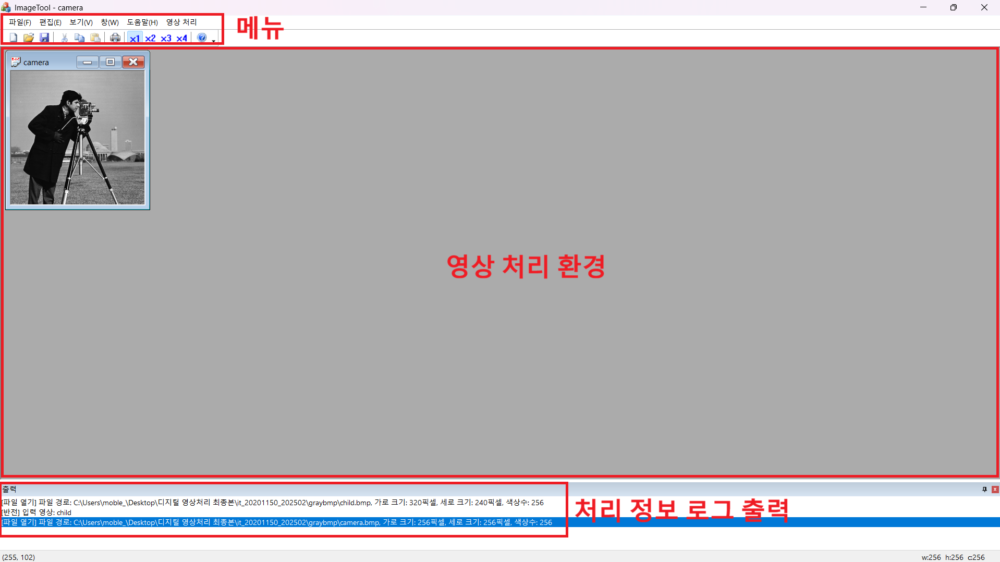

### 전체 프로그램 화면
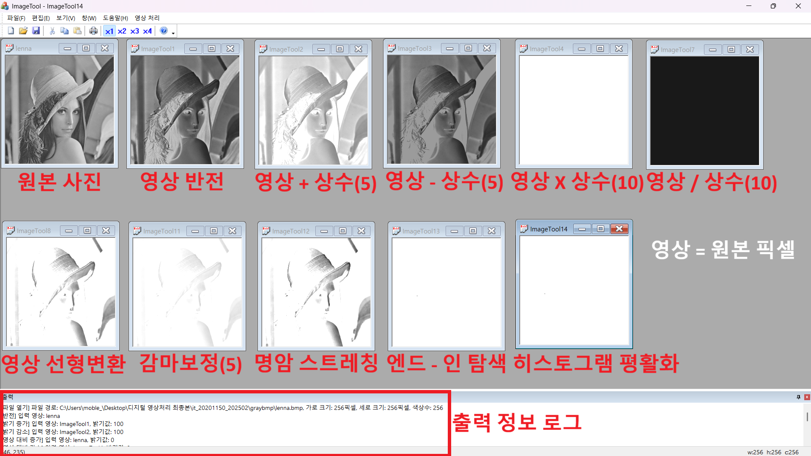

### 영상 처리 기능 목록
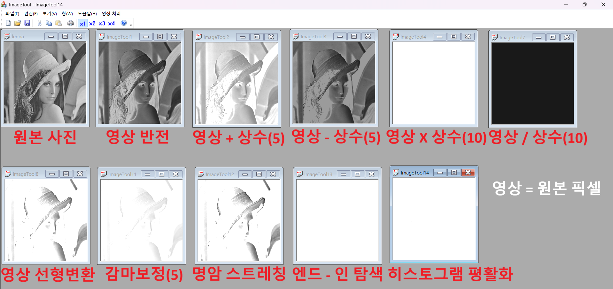

### 영상처리 메뉴
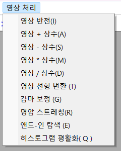

### 보기 메뉴
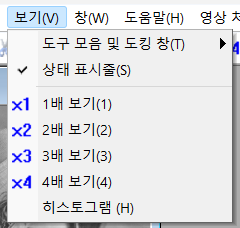

### 영상 반전 처리
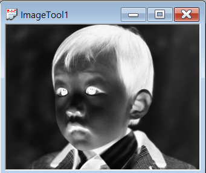

### 2배 확대
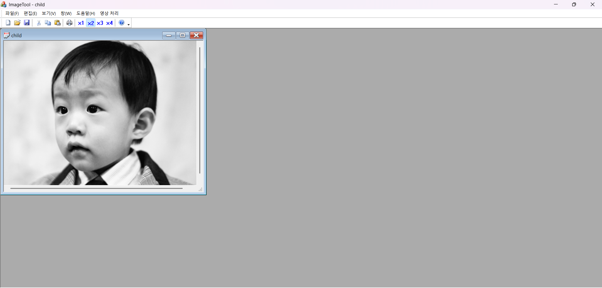

### 4배 확대
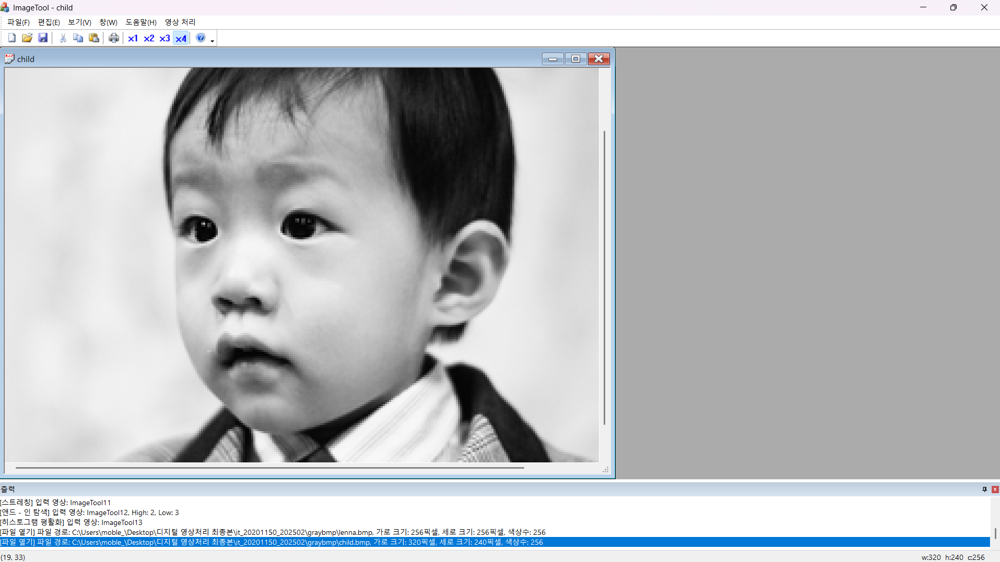

### UI 스크린샷
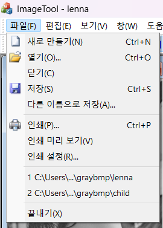
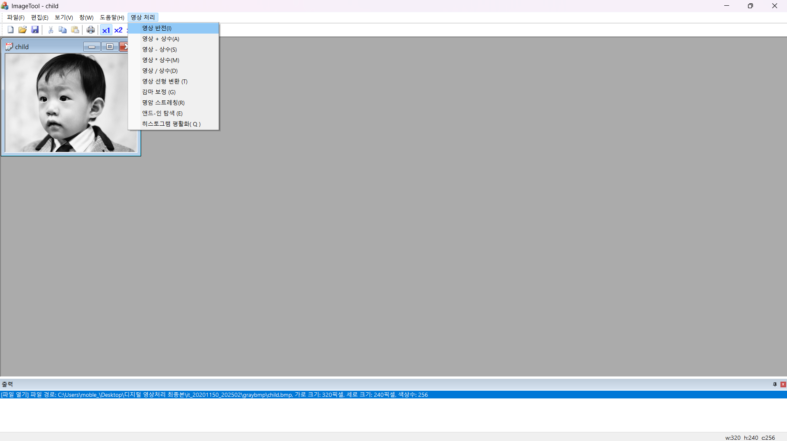
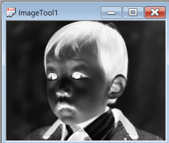

---

## 프로젝트 구조

```
it_20201150_202502/
├── ImageTool.sln              # Visual Studio 솔루션 파일
├── ImageTool.vcxproj          # 프로젝트 파일
│
├── ImageTool.cpp / .h         # 애플리케이션 진입점
├── ImageToolDoc.cpp / .h      # 문서(Document) 클래스 - BMP 데이터 관리
├── ImageToolView.cpp / .h     # 뷰(View) 클래스 - 화면 렌더링
├── MainFrm.cpp / .h           # 메인 프레임 (메뉴·툴바)
├── ChildFrm.cpp / .h          # 자식 프레임
│
├── AddConst.cpp / .h          # 상수 덧셈 처리
├── SubConst.cpp / .h          # 상수 뺄셈 처리
├── MultiConst.cpp / .h        # 상수 곱셈 처리
├── DivdConst.cpp / .h         # 상수 나눗셈 처리
│
├── InverseImage.cpp / .h      # 영상 반전
├── GammaCorrection.cpp / .h   # 감마 보정
├── GreyTransform.cpp / .h     # 그레이스케일 변환
│
├── GetHistogram.cpp / .h      # 히스토그램 계산
├── GetStretching.cpp / .h     # 히스토그램 스트레칭
├── GetSmoothing.cpp / .h      # 평활화 필터
├── GetEndin.cpp / .h          # 에지 검출
│
├── C*Dlg.cpp / .h             # 각 기능별 입력 다이얼로그
├── OutputWnd.cpp / .h         # 출력 창
│
├── IppImage/                  # IPP 이미지 라이브러리
├── graybmp/                   # 테스트용 그레이스케일 BMP 이미지
└── res/                       # 아이콘·리소스
```

---

## 빌드 방법

1. `it_20201150_202502/ImageTool.sln` 을 Visual Studio 2019 이상으로 열기
2. 솔루션 구성: **Debug** 또는 **Release** 선택
3. **빌드 → 솔루션 빌드** (Ctrl+Shift+B)
4. `Debug/` 또는 `Release/` 폴더의 `ImageTool.exe` 실행

> **요구 사항**: Windows 10/11, Visual Studio 2019+, MFC 컴포넌트 설치 필요

---

## 핵심 구현 포인트

- **Document-View 아키텍처**: `CImageToolDoc`에서 픽셀 데이터를 보관하고 `CImageToolView`에서 `CDC`로 직접 렌더링
- **화소 처리 루프**: 각 알고리즘은 BMP의 `BYTE*` 버퍼를 행·열 단위로 순회하며 변환값 적용
- **다이얼로그 기반 입력**: 상수값·감마값 등 파라미터는 MFC `CDialog` 파생 클래스로 입력받아 처리 클래스로 전달
- **히스토그램 시각화**: `GDI` 막대 그래프를 다이얼로그 내 `OnPaint`에서 직접 그려 256 레벨 분포 표시
